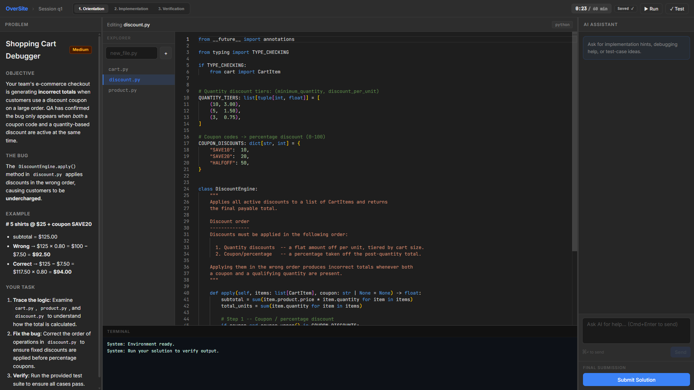
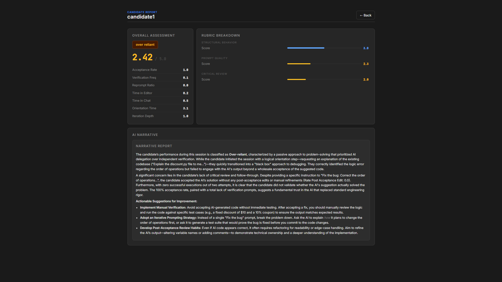

  

OverSite is an online assessment (OA) platform for technical hiring—similar to CodeSignal or HackerRank—with a key difference: **candidates can use AI during the assessment**, and the platform **reports on how they use it**. Recruiters get both correctness and behavioral insights: how candidates prompt the AI, review suggestions, and verify their work.

Candidates code in a browser-based IDE with an embedded AI assistant. Sessions are scored for behavioral signals (e.g. over-reliant vs. strategic AI use) and summarized in recruiter-facing reports. OverSite is built for the reality that AI-assisted coding is the norm—assess and hire for how people work with AI, not in spite of it.

## Overview

### Core Functionality

* **IDE & session environment:** VS Code–like workspace (Monaco editor, file explorer, terminal) with phased flows (Orientation → Implementation → Verification). Candidates open a problem, edit code, run tests, and use an in-panel AI chat—all in the browser.
* **Real-time telemetry:** Editor events (edits, deltas), execute events (terminal runs, exit codes), panel focus, and AI suggestion accept/reject/modify decisions are logged with timestamps. Cursor-style diff UI captures how candidates use AI suggestions before committing.
* **Behavioral scoring:** A multi-model pipeline that evaluates candidate behavior. It uses an XGBoost classifier for structural signals (e.g., prompt frequency) and reports telemetry like acceptance rates and deliberation time. A Gemini-based judge provides a session summary and highlights key behavioral evidence.

### Machine Learning Architecture

OverSite evaluates candidates across three primary dimensions using a multi-model scoring system:

1.  **Behavioral Patterns**: An XGBoost classifier trained on the **Microsoft CUPS** dataset.
    - **Classifier Path**: Uses a subset of 3 structural features (prompt frequencies, iteration depth).
    - **Evidence Path**: Reports telemetry (Acceptance Rate, Deliberation Time, Edit Rate) and metrics like `deliberation_to_action_ratio` to the Gemini judge.
    - **Calibration**: Uses **Platt Scaling** to ensure output probabilities are reliable for final scoring.
2.  **Prompt Quality**: An XGBoost model trained on the **AI2 WildChat** dataset. It evaluates prompts based on engineering specificity, distinguishing between skilled prompting and simple copy-pasting.
3.  **Critical Review**: A heuristic engine measuring the **Levenshtein Distance** between AI-proposed code and the final submission. This measures how much a candidate modified or verified AI suggestions.

### How It Works

1. **Input / Ingestion:** Candidates start a session, and the frontend streams editor events, execution results, panel focus, and AI chat interactions.
2. **Processing / Validation:** The backend stores events in SQLite. At session end, the scoring engine extracts features, applies the XGBoost models, and runs the rule-based logic. A Gemini call generates the session summary.
3. **Execution / State Update:** Session data, files, and `session_scores` (results, summary, feature importance) are persisted. Admins can trigger re-scoring if needed.
4. **Output / Response:** Recruiters view session scores and the Gemini-generated summary in the admin dashboard. The candidate-facing UI manages the active IDE session.

  
<b>View Screenshots</b>

  | Login | Problem Selection | IDE | Session Report |
  | :---: | :---: | :---: | :---: |
  |  |  |  |  |

## Impact & Performance

* **Fallback mode:** If ML models are unavailable, `SCORING_FALLBACK_MODE=true` uses rule-based behavioral patterns instead.
* **Session lifecycle:** Assessments have set time limits. Scoring runs at session end; only the Gemini-based summary runs asynchronously.

## Applications / Use Cases

* **Technical hiring & OAs:** Run take-home or timed coding assessments with an embedded AI assistant; evaluate both correctness and how candidates use AI (decomposition, prompting, verification, critical review).
* **Behavioral differentiation:** Produce consistent, defensible behavioral labels and narratives (e.g. over_reliant vs. strategic) from real session data instead of post-hoc interviewer judgment.
* **Recruiter dashboards:** Admin view for session lists, detailed scores, and Gemini-generated summaries to support hiring.

## Documentation

* **[SETUP.md](docs/SETUP.md):** Installation, environment configuration, and startup instructions.
* **[ARCHITECTURE.md](docs/ARCHITECTURE.md):** System design, data flow, glossary, and design decisions.
* **[API.md](docs/API.md):** REST (JSON) API and session/auth reference.
* **[TESTING.md](docs/TESTING.md):** Testing guidelines.
* **[STYLE.md](docs/STYLE.md):** Coding standards, testing guidelines, and repository conventions.

## License

See **[LICENSE](LICENSE)** file for details.
