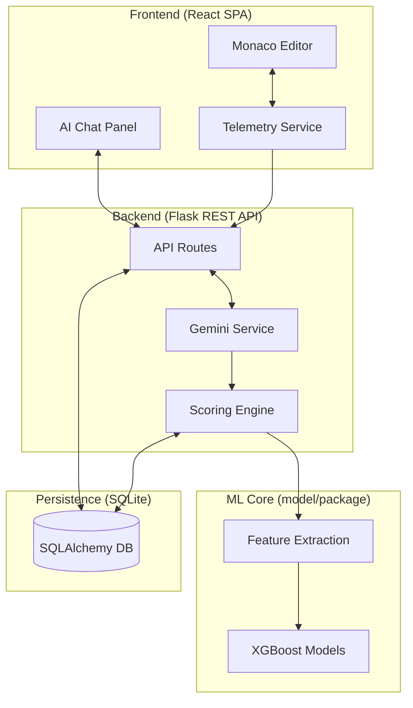

# Architecture Documentation

This document details the architectural decisions, system components, and data flow for MadData IDE.

---

## Glossary

* **Candidate:** The user performing the technical interview.
* **EditorEvent:** A record of a single code modification or file action.
* **Interaction:** A single turn in the AI chat panel.
* **Scoring Pipeline:** The backend process that analyzes candidate behavior and code to produce a multi-dimensional score.
* **X-Session-ID:** A unique identifier for an active interview session, used for authentication and logging.

## System Overview
MadData IDE is built as a **Client-Server** application:
* **Frontend**: A React Single Page Application (SPA) that provides a VS Code-like environment for candidates.
* **Backend**: A Flask REST API that manages session state, logs candidate telemetry, and integrates with LLMs for real-time assistance.
* **Database**: SQLite (SQLAlchemy) for persistence, storing sessions, events, and AI interactions.



## Directory Structure
```
/root
├── backend/          # Flask server, route controllers, and DB schema
│   ├── routes/       # API endpoints (auth, session, ai, events, etc.)
│   ├── services/     # Business logic (diffing, scoring, model loading)
│   └── tests/        # Pytest suite
├── frontend/         # React application
│   ├── src/
│   │   ├── components/ # UI components (Monaco editor, Chat panel)
│   │   ├── hooks/      # Custom React hooks (useSession, useAuth)
│   │   └── api.ts      # Axios configuration
├── model/            # Unified feature extraction and ML model artifacts
└── problems/         # Static problem definitions and initial file contents
```

## Data Life Cycle

The path from a single keystroke to a behavioral score:

1. **Ingestion (Frontend):** Monaco editor captures `EditorEvents`. These are debounced and sent to the `/events/editor` endpoint as full content snapshots or deltas.
2. **Persistence (Backend):** Each event is timestamped and stored in the `EditorEvents` table, preserving the chronological history of the implementation.
3. **Extraction (Scoring Service):** Upon session submission, the `ScoringEngine` retrieves the full event history. It uses the `model.features` package to extract behavioral signals (e.g., `rate_acceptance`, `freq_verification`).
4. **Inference (ML Core):** Extracted features are fed into pre-trained **XGBoost models** to generate normalized scores for technical proficiency and behavioral alignment.
5. **Synthesis (LLM Judge):** The final score and the conversation history are sent to **Gemini** to synthesize a human-readable narrative.

## Data Model (Database Schema)

The persistence layer is managed via SQLAlchemy. Below are the core entities:

### 1. Sessions & Files
* **`Session`**: Tracks the interview lifecycle (`started_at`, `ended_at`, `username`, `project_name`).
* **`File`**: Represents a file in the workspace context, linked to a session.

### 2. Telemetry & AI 
* **`Event`**: High-level telemetry (actors: `system`, `user`; types: `execute`, `panel_focus`). Stores flexible JSON `metadata`.
* **`EditorEvent`**: Fine-grained code modification logs. Stores the full `content` or `edit_delta` for every keystroke group.
* **`AIInteraction`**: Logs prompts and responses between the candidate and Gemini.
* **`AISuggestion`**: Links AI responses to specific code hunks, tracking if they were accepted, rejected, or modified.

### 3. Scoring
* **`SessionScore`**: Stores the final output of the scoring pipeline, including narrative feedback, importance metrics, and raw feature values.

## Detailed Scoring Engine

The scoring engine is divided into three primary components, defined in `backend/services/scoring.py` and `model/features.py`.

### Component 1 (C1): Behavioral Signal
Analyzes *how* the candidate works. It extracts **15 features** from telemetry, including:
* **`rate_acceptance`**: Ratio of AI suggestions accepted without modification.
* **`duration_deliberation_avg`**: Average time spent reviewing a code suggestion before acting.
* **`freq_verification`**: How often the candidate runs tests/terminal vs. how much they edit.
* **`pct_time_editor` vs. `pct_time_chat`**: Balance of active coding vs. conversing with AI.

### Component 2 (C2): Prompt Quality
Evaluates the candidate's engineering communication.
* Analyzes prompt intent (e.g., orientation vs. debugging).
* Scores prompts based on specificity, context provision, and goal clarity.

### Component 3 (C3): Technical Depth (The "Judge")
An LLM-based verification step that reviews the final code and the candidate's interaction history to produce the human-readable narrative.

## Tech Stack & Decision Record

| Category | Technology | Rationale |
| :--- | :--- | :--- |
| **Frontend** | React / Vite | Need for a fast, component-based UI with rich interactive states. |
| **Editor** | Monaco Editor | Industry standard for code editing, familiar to candidates. |
| **Backend** | Flask | Lightweight and flexible for rapid prototyping of REST APIs. |
| **Database** | SQLite | Serverless and simple for hackathon/demo deployments. |
| **AI SDK** | Gemini (Google Gen AI) | State-of-the-art LLM capabilities for code generation and analysis. |
| **ML Libraries** | Scikit-learn / XGBoost | Robust ecosystem for the behavioral scoring engine. |

## Design Constraints & Trade-offs

* **Decision: Monolithic Backend**
  * **Rationale:** Prioritized simplicity and ease of deployment for the demo environment. Deferring extraction until specific scaling needs arise.
* **Decision: In-memory Editor State** 
  * **Rationale:** A single-user interview environment does not require real-time collaboration with the interviewer, simplifying the persistence model to periodically synced events. 

---
